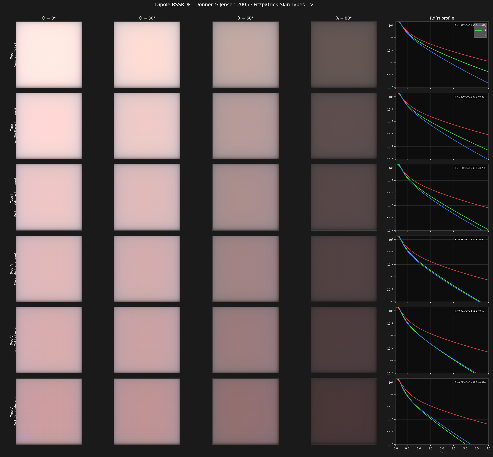

# Dipole Subsurface Scattering: Donner & Jensen 2005

A fully **differentiable** PyTorch implementation of the multi-layered dipole
BSSRDF, parameterised with realistic optical properties for all six Fitzpatrick
skin types.



---

## Table of contents

1. [Physics of subsurface scattering](#1-physics-of-subsurface-scattering)
2. [The dipole approximation](#2-the-dipole-approximation)
3. [Multi-layer extension (Donner & Jensen 2005)](#3-multi-layer-extension)
4. [Skin optics and the Fitzpatrick scale](#4-skin-optics-and-the-fitzpatrick-scale)
5. [Differentiability and gradient flow](#5-differentiability-and-gradient-flow)
6. [Quick start](#6-quick-start)
7. [Project structure](#7-project-structure)
8. [References](#8-references)

---

## 1. Physics of subsurface scattering

When light hits a translucent material it does not simply reflect at the
surface.  Instead, photons penetrate the medium, undergo multiple scattering
events, and eventually re-emerge at a different surface location.  The
governing equation is the **radiative transfer equation (RTE)**:

```
(ω · ∇) L(x, ω) = −σ_t L(x, ω)
                  + σ_s ∫_{4π} p(ω, ω') L(x, ω') dω'
                  + Q(x, ω)
```

where
- `L(x, ω)` is the radiance at position **x** in direction **ω**
- `σ_a`, `σ_s` are the absorption and scattering coefficients [mm⁻¹]
- `σ_t = σ_a + σ_s` is the total extinction coefficient
- `p(ω, ω')` is the phase function (here: Henyey-Greenstein with `g ≈ 0.8`)
- `Q` is the source term (incident illumination)

The **mean free path** `l = 1/σ_t` is the average distance between scattering
events; for skin `l ≈ 0.05 mm`.

### Diffusion approximation

When scattering dominates (`σ_s >> σ_a`, i.e. high albedo), the RTE simplifies
to the **diffusion equation**:

```
∇²Φ(x) − σ_tr² Φ(x) = −Q(x)     where σ_tr = √(3 σ_a σ'_t)
```

Here `Φ` is the fluence rate (integral of radiance over all directions) and
`σ'_t = σ_a + σ'_s` with `σ'_s = σ_s (1 − g)` the **reduced scattering**
coefficient.

The diffusion coefficient is `D = 1 / (3 σ'_t)`.

---

## 2. The dipole approximation

Jensen et al. (2001) solve the diffusion equation for a semi-infinite medium
by placing two point sources: the **real dipole** at depth `z_r` (where the
refracted ray enters the medium) and a **virtual dipole** above the surface at
`z_v` (to enforce the zero-flux boundary condition):

```
z_r = 1 / σ'_t
z_v = z_r + 4 A D
```

The boundary parameter `A` accounts for total internal reflection:

```
A   = (1 + F_dr) / (1 − F_dr)
F_dr ≈ −1.44/η² + 0.71/η + 0.668 + 0.0636 η     (Fresnel moment, Jensen 2001)
```

For skin `η ≈ 1.4`, this gives `F_dr ≈ 0.53` and `A ≈ 3.25` (values from the
polynomial fit as implemented in `sss/dipole.py::fresnel_moment1`).

### The dipole BSSRDF

The diffuse reflectance profile (exitant flux per unit irradiance at radial
distance `r` from the entry point) is:

```
Rd(r) = (α' / 4π) · [ z_r (σ_tr d_r + 1) e^{−σ_tr d_r} / d_r³
                      + z_v (σ_tr d_v + 1) e^{−σ_tr d_v} / d_v³ ]
```

where
```
α'  = σ'_s / σ'_t             reduced albedo
d_r = √(r² + z_r²)            distance from real source to exit point
d_v = √(r² + z_v²)            distance from virtual source to exit point
```

The full BSSRDF including Fresnel correction at entry and exit:

```
S(xᵢ, ωᵢ, xₒ, ωₒ) = (1/π) · Ft(xᵢ, ωᵢ) · Rd(‖xᵢ − xₒ‖) · Ft(xₒ, ωₒ)
```

### Hemispherical reflectance

Integrating Rd over the surface gives the total fraction of light that
re-emerges (analogous to albedo):

```
R_hemi = ∫₀^∞ Rd(r) · 2π r dr
```

This is computed numerically via trapezoidal quadrature in `sss/renderer.py`.

---

## 3. Multi-layer extension

### Motivation

Real skin is **stratified**: a thin, highly-pigmented epidermis sits above a
thicker, blood-rich dermis, which sits above subcutaneous fat.  Treating the
skin as a single homogeneous slab ignores the characteristic colour shift
caused by haemoglobin in the dermis and melanin in the epidermis.

### Donner & Jensen 2005

The key insight is to treat each layer as its own dipole medium and then
**compose** the layer responses using the **adding-doubling** principle.

For a two-layer system (epidermis thickness `d_0`, dermis semi-infinite):

```
Rd_total(r) = Rd_0(r) + Td_0² · Rd_1(r) / (1 − R_hemi_1 · R_hemi_0_back)
```

where
- `Rd_0(r)`: epidermis single-layer dipole profile
- `Rd_1(r)`: dermis single-layer dipole profile
- `Td_0 = exp(−σ_tr_0 · d_0)`: diffuse transmittance through epidermis
- `Td_0²`: accounts for light passing through the epidermis **twice** (once down, once up)
- `R_hemi_1`: hemispherical reflectance of dermis
- `R_hemi_0_back`: hemispherical reflectance of epidermis seen from inside

The denominator captures multiple inter-layer reflections (the **Fabry-Pérot
effect** for diffuse light).  For typical skin values this denominator is
close to 1, but it matters for fair skin with high dermal blood content.

For `N > 2` layers the recurrence is applied back-to-front:

```python
Rd_stack = Rd[-1]
for i in reversed(range(N-1)):
    R_below = ∫ Rd_stack · 2πr dr
    R_i_back = ∫ Rd[i] · 2πr dr
    Rd_stack = Rd[i] + Td[i]² · Rd_stack / (1 − R_below · R_i_back)
```

---

## 4. Skin optics and the Fitzpatrick scale

The Fitzpatrick scale (1975) classifies skin by its response to UV exposure,
correlating closely with melanin content.  We parameterise each type by:

| Type | Description          | f_mel  | f_blood | d_epi [mm] |
|------|----------------------|--------|---------|-----------|
| I    | Very fair (Celtic)   | 0.010  | 0.010   | 0.008     |
| II   | Fair (N. European)   | 0.040  | 0.015   | 0.010     |
| III  | Medium (mid-European)| 0.100  | 0.020   | 0.012     |
| IV   | Olive (Mediterranean)| 0.180  | 0.025   | 0.014     |
| V    | Brown (Middle East)  | 0.270  | 0.030   | 0.016     |
| VI   | Dark (Sub-Saharan)   | 0.430  | 0.040   | 0.020     |

### Optical coefficients [mm⁻¹] at R≈650 nm / G≈532 nm / B≈450 nm

**Epidermis absorption** (melanin-dominated):
```
σ_a_epi = f_mel · σ_a_mel + (1 − f_mel) · σ_a_tissue
σ_a_mel    = [1.70, 2.80, 4.80]   # eumelanin, Krishnaswamy 2004
σ_a_tissue = [0.028, 0.055, 0.130]
```

**Dermis absorption** (haemoglobin-dominated):
```
σ_a_derm = f_blood · σ_a_oxy + (1 − f_blood) · σ_a_tissue
σ_a_oxy    = [0.28, 8.40, 3.20]   # oxyhemoglobin at 1% vol fraction
```

**Scattering** (Mie + Rayleigh, wavelength-dependent):
```
σ_s_epi  = [14.0, 18.0, 24.0]   g ≈ 0.79
σ_s_derm = [18.0, 22.0, 28.0]   g ≈ 0.79
```

The strong wavelength dependence of scattering (Rayleigh ∝ λ⁻⁴) means blue
light scatters most, explaining why bruises appear blue and why veins look
blue through skin even though blood is red.

### Why fair skin looks pink and dark skin looks neutral

In Type I skin (`f_mel ≈ 0.01`), the epidermis is nearly transparent.
Most light reaches the blood-rich dermis, which has a strong green-channel
absorption peak from oxyhemoglobin (σ_a_G ≈ 8.4 mm⁻¹).  The resulting
spectrum is depleted in green, giving the characteristic pink appearance.

In Type VI skin (`f_mel ≈ 0.43`), the epidermis absorbs heavily across all
channels, but most so in blue and green.  The dermis contributes less because
light is attenuated before reaching it.  The net spectrum is darker and more
spectrally flat.

---

## 5. Differentiability and gradient flow

All six optical parameters per layer are stored as **log-space `nn.Parameter`**:

```python
self.log_sigma_a_epi = nn.Parameter(sigma_a_epi.log(), requires_grad=learnable)
```

The `exp()` property ensures positivity while keeping the parameter
unconstrained, which is essential for gradient-based optimisation:

```python
@property
def sigma_a_epi(self):
    return self.log_sigma_a_epi.exp()
```

The entire BSSRDF evaluation, from optical parameters to rendered pixel
values, is a composition of `torch.sqrt`, `torch.exp`, element-wise
arithmetic, and `torch.trapezoid`, all of which have well-defined autograd
gradients.

### Inverse-rendering use case

To fit skin type from an RGB photograph:

```python
model, _ = build_skin_bssrdf("III", learnable=True)
optimizer = torch.optim.Adam(model.parameters(), lr=1e-2)

for step in range(1000):
    Rd = model(r_observed)
    loss = F.mse_loss(Rd, Rd_target)
    optimizer.zero_grad()
    loss.backward()
    optimizer.step()
```

Gradients flow from the rendered pixel loss back through the volume rendering
integral, the dipole formula, and into `f_mel` and `f_blood` (via the log
parameterisation).

---

## 6. Quick start

```bash
python -m venv .venv && source .venv/bin/activate
pip install -r requirements.txt
python plot_comparison.py            # → skin_comparison.png
python plot_comparison.py --px 256  # higher resolution
```

### Programmatic use

```python
import torch
from sss.skin_params import build_skin_bssrdf
from sss.renderer import build_r_grid, hemispherical_reflectance

# Build model for skin type III (differentiable)
model, ftype = build_skin_bssrdf("III", learnable=True)

# Evaluate BSSRDF profile
r = build_r_grid(r_max=5.0, n=512)
Rd = model(r)             # (512, 3): R, G, B channels

# Hemispherical reflectance (total diffuse albedo)
R_hemi = hemispherical_reflectance(Rd, r)  # (3,)
print(R_hemi)  # tensor([1.126, 0.745, 0.752]) measured for Type III

# Gradient example: differentiate R_hemi w.r.t. melanin fraction
R_hemi.sum().backward()
print(model.log_sigma_a_epi.grad)
```

Note that `R_hemi` here is the raw dipole-model integral, not a
radiometrically normalised albedo, so components above 1 (as for the R
channel above) do occur; `plot_comparison.py` renormalises by the 99th
percentile across all rendered images before display, which is why the
figure itself stays visually plausible.

---

## 7. Project structure

```
sss-dipole/
├── sss/
│   ├── dipole.py        : single-layer dipole BSSRDF (Jensen 2001)
│   ├── multilayer.py    : multi-layer extension + SkinBSSRDF model
│   ├── skin_params.py   : Fitzpatrick I-VI optical parameters
│   └── renderer.py      : flat-patch renderer, hemispherical integrals
├── plot_comparison.py   : produces the comparison figure
├── requirements.txt
└── README.md
```

---

## 8. References

1. **Jensen H.W., Marschner S.R., Levoy M., Hanrahan P.** (2001).
   "A practical model for subsurface light transport."
   *SIGGRAPH 2001 Proceedings*, pp. 511–518.

2. **Donner C., Jensen H.W.** (2005).
   "Light diffusion in multi-layered translucent materials."
   *SIGGRAPH 2005 Proceedings*, pp. 1032–1039.

3. **Krishnaswamy A., Baranoski G.V.G.** (2004).
   "A biophysically-based spectral model of light interaction with human skin."
   *Computer Graphics Forum 23(3)*, pp. 331–340.

4. **Meglinski I.V., Matcher S.J.** (2002).
   "Quantitative assessment of skin layers absorption and skin reflectance
   spectra simulation in the visible and near-infrared spectral regions."
   *Physiological Measurement 23(4)*, pp. 741–753.

5. **Fitzpatrick T.B.** (1975).
   "Soleil et peau" (Sun and skin). *Journal de Médecine Esthétique*.

6. **Jacques S.L.** (2013).
   "Optical properties of biological tissues: a review."
   *Physics in Medicine and Biology 58(11)*, pp. R37–R61.
